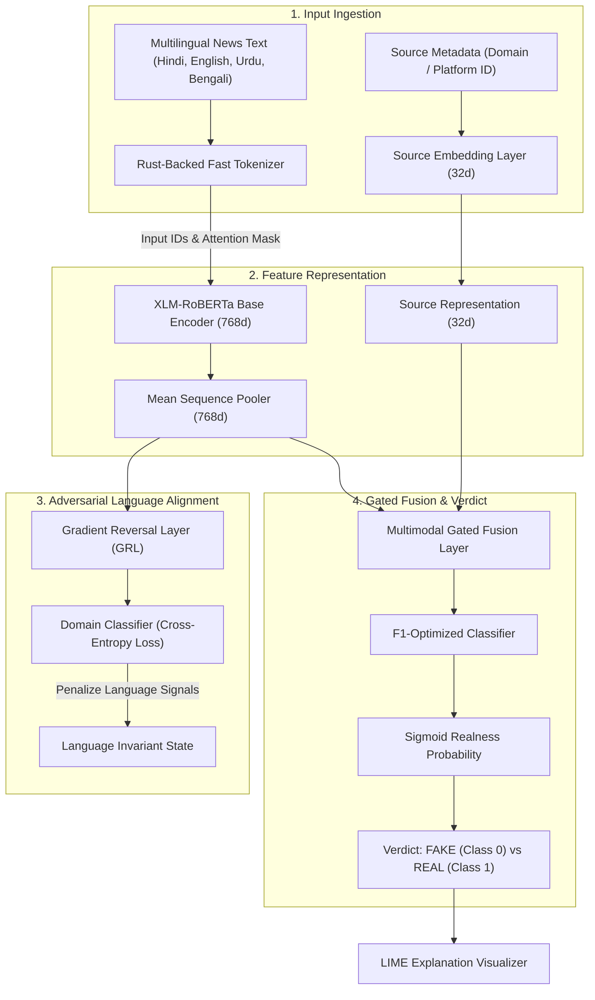
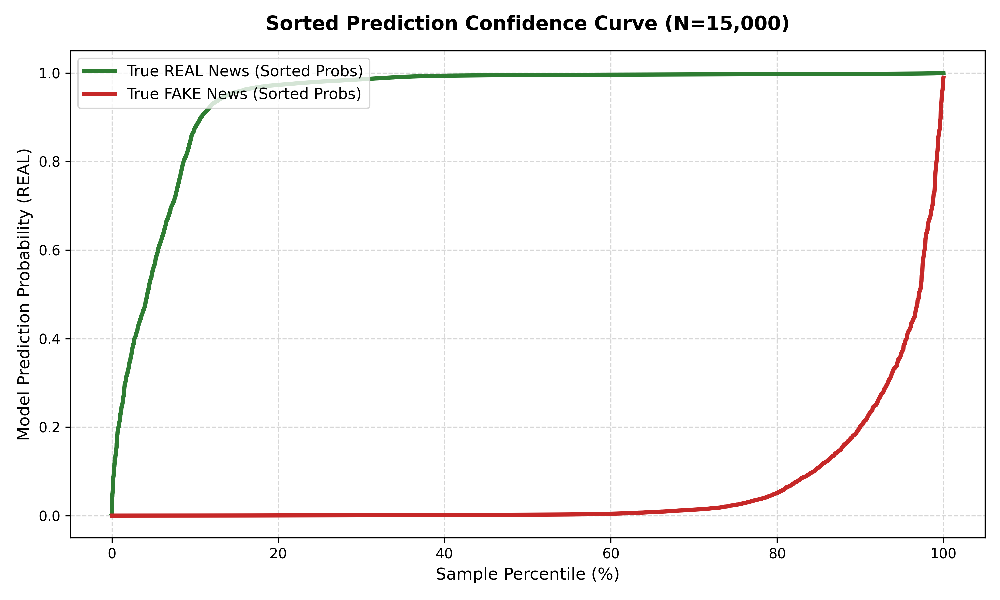
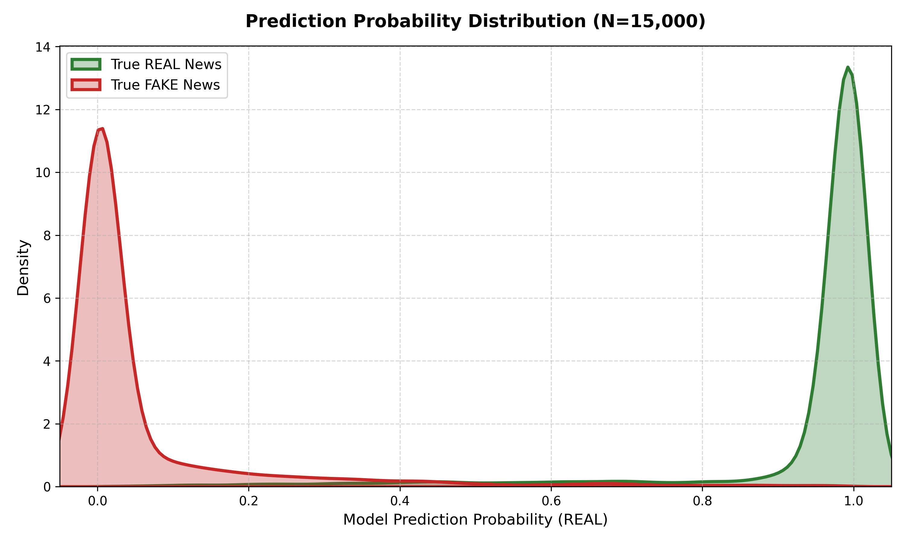
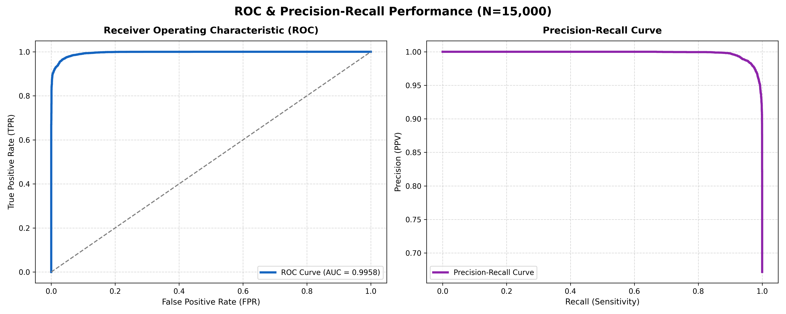
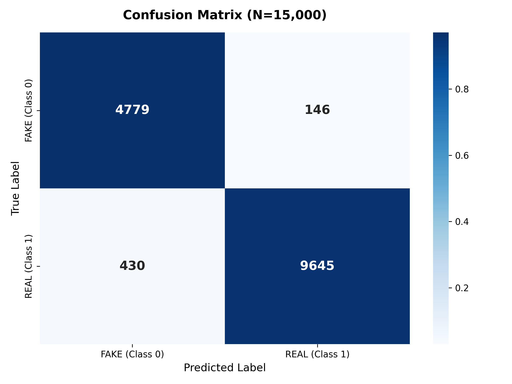

# FactFinder: Fake News Detection

Welcome to **FactFinder**, a project I built to help detect fake news across multiple languages (English, Hindi, Urdu, Bengali). It uses a deep learning model to analyze text and source metadata, trying to figure out if a news piece is real or misleading.

## How it works

The core of the system is a neural network built with PyTorch. Instead of just looking at the text, the model also considers where the news came from (the source). 

Here's a breakdown of the approach:
1. **Text processing**: Uses XLM-RoBERTa to understand the text in different languages.
2. **Adversarial Training**: I added a Gradient Reversal Layer (GRL) during training. This basically forces the model to focus on the actual "deceptive" writing style rather than just memorizing language-specific quirks.
3. **Fusion**: Combines the text features with source metadata.
4. **Classification**: Outputs a probability score for whether the text is real or fake.



## Results

I evaluated the model on a validation set of about 15,000 samples. It performs reasonably well at separating real vs. fake news. The `reports/` folder contains some performance graphs like ROC curves and confusion matrices if you want to dive into the numbers.

### 1. Sorted Prediction Confidence Curve


### 2. Confidence Density (KDE Plot)


### 3. ROC & Precision-Recall Curves


### 4. Normalized Confusion Matrix Heatmap


## Tech Stack

- **Model**: PyTorch, HuggingFace Transformers (XLM-RoBERTa)
- **Backend API**: FastAPI (handles inference and basic caching)
- **Frontend**: Streamlit (a web dashboard to test out the model)
- **Explainability**: Uses LIME to highlight which words contributed most to the model's decision.

## Repository Structure

- `src/model.py` - Contains the PyTorch model architecture.
- `src/train.py` - The training loop and validation script.
- `api/` - FastAPI backend for serving the model.
- `app.py` - Streamlit dashboard.
- `scratch/` - Scripts for generating evaluation graphs.
- `extension/` - A Chrome extension for checking news in the browser.

## Getting Started

### 1. Setup

First, clone the repository and set up a virtual environment:

```bash
git clone https://github.com/your-username/factfinder.git
cd factfinder

# Activate your virtual environment (Windows example)
myenv\Scripts\activate

# Install dependencies
pip install -r requirements.txt
```

### 2. Run the Web Dashboard
The easiest way to test the model is through the Streamlit app. This will start a local web server where you can paste news articles:
```bash
streamlit run app.py
```

### 3. Run the Backend API
If you want to use the API directly or power the browser extension:
```bash
python start_production.py
```

### 4. Generate Evaluation Graphs
If you want to recreate the performance plots:
```bash
python scratch/generate_paper_graphs.py
```

---
**Developed by**: Khan Zeeshan
