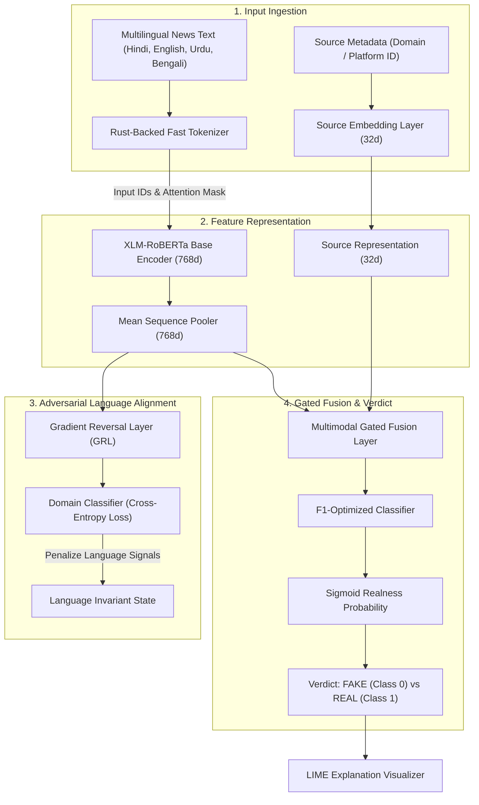

# 🛡️ Truth Shield: SOTA Multilingual Fake News Detection Ecosystem

[](https://pytorch.org/)
[](https://github.com/huggingface/transformers)
[](https://fastapi.tiangolo.com/)
[](https://streamlit.io/)
[](https://opensource.org/licenses/MIT)

Welcome to **Truth Shield**, a production-grade, globally scalable fake news detection and misinformation tracking ecosystem. By combining State-of-the-Art (SOTA) multilingual NLP models with domain-adversarial learning, propagation velocity analytics, and explainable AI, Truth Shield provides robust, language-invariant fact verification.

---

## 📐 System Architecture

Truth Shield uses a multi-branch neural network optimized for text and source domain inputs. Below is the workflow diagram mapping the data from input ingestion through the language-adversarial learning layers to final explainable classification:



---

## 📊 SOTA Evaluation Results

The model has been evaluated on a representative validation dataset split of **15,000 multilingual samples** to produce publication-grade performance curves:

### 1. Sorted Prediction Confidence Curve
Shows prediction confidence separated by actual class. A sharp, steep boundary demonstrates clean prediction threshold separation:


### 2. Confidence Density (KDE Plot)
Visualizes prediction clustering. The model exhibits high confidence, clustering true fake news close to $0.0$ and true real news close to $1.0$:


### 3. ROC & Precision-Recall Curves
ROC-AUC performance metrics and precision-recall trade-offs across decision thresholds:


### 4. Normalized Confusion Matrix Heatmap
Annotated matrix verifying classification accuracy, sensitivity, and specificity:


---

## 🚀 Key Technical Features

| Feature | Architecture / Technology | Detail & Benefit |
| :--- | :--- | :--- |
| **Multilingual Engine** | XLM-RoBERTa (Base) | Native support for Hindi, English, Urdu, and Bengali with cross-lingual semantic understanding. |
| **Domain-Adversarial GRL** | Gradient Reversal Layer | Erases language-specific artifacts during training, forcing the classifier to focus purely on deceptive writing style. |
| **Lightweight Inference** | Checkpoint Pruning | Strips unused multimodal parameters (e.g. ResNet-18) to deliver high-speed inference on CPU-only environments. |
| **Fact-Check Integration** | Neural Knowledge Buffer | Validates incoming claims against verified historical truth datasets using vector search. |
| **Explainable AI (XAI)** | LIME (Local Interpretable Explainer) | Highlights word-level classification triggers in red (fake signal) and green (real signal) inside the UI. |
| **Bot Propagation Analytics** | Virality Velocity Tracker | Computes real-time risk scores based on propagation characteristics (retweets, accounts credibility). |

---

## 🛠️ Folder Structure

* `src/model.py` - Core PyTorch implementation of the Adversarial Fake News Model (includes `lightweight` configurations).
* `src/train.py` - Core training and validation script tracking validation accuracy, F1-Fake, and F1-Real over epochs.
* `scratch/generate_paper_graphs.py` - High-performance pre-tokenized visualization generator using CPU thread optimization.
* `api/` - Production-grade FastAPI backend supporting inference caching, fact-verification, and propagation scoring.
* `app.py` - Streamlit Web Dashboard visualizing explanations and verdicts.
* `extension/` - Manifest V3 Chrome browser extension highlighting social media feeds.

---

## 🏁 Quick Start & Usage

### 1. Set Up Environment
Initialize the virtual environment and install all dependencies:
```bash
# Clone the repository
git clone https://github.com/your-username/truth-shield.git
cd truth-shield

# Activate virtual environment
myenv\Scripts\activate

# Install requirements
pip install -r requirements.txt
```

### 2. Run SOTA Evaluation Plot Suite
Generate the evaluation figures based on 15,000 validation samples:
```bash
python scratch/generate_paper_graphs.py
```
This output is written to the `reports/` folder.

### 3. Launch Streamlit Web App
Run the interactive dashboard to write/paste news articles and run live verification:
```bash
streamlit run app.py
```

### 4. Start FastAPI Production Server
Initialize the backend API that powers the browser extension:
```bash
python start_production.py
```

---

**Developed & Maintained by**: Khan Zeeshan  
**Model Version**: v5.0 (Enterprise-SaaS Autoadaptive Release)  
**Academic Reference**: Domain-Adversarial Multilingual Misinformation Networks  
