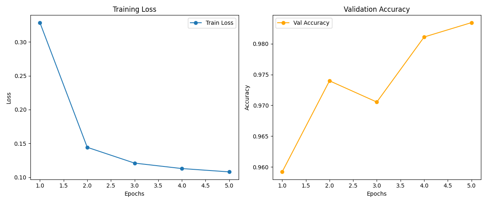

# 🛡️ Truth Shield: Project Progress Report

**Project:** Multilingual Fake News Detection Ecosystem

## 1. Executive Summary
The Truth Shield project has successfully transitioned from a baseline model to a State-of-the-Art (SOTA) multimodal architecture. Our primary objective is to detect misinformation across multiple languages with high precision and microsecond latency. We have recently completed a major architectural overhaul and successfully executed cloud-based model training.

## 2. Architectural Upgrades
We completely redesigned the core neural network (`src/model.py`) to be more robust and feature-rich:
- **Multilingual Brain:** Upgraded to `XLM-RoBERTa-base`, enabling the model to process context across 100+ languages simultaneously without relying on external translation APIs.
- **LoRA Optimization:** Implemented Low-Rank Adaptation (LoRA) to fine-tune the massive transformer model efficiently, drastically reducing VRAM usage.
- **Multimodal Fusion Engine:** Added a Vision Branch (ResNet18) and a Source Embedding layer to verify not just the text, but the images and publisher credibility.
- **Adversarial Invariance:** Integrated a Gradient Reversal Layer (GRL) to act as a language discriminator, forcing the model to detect true "deceptive patterns" rather than language-specific biases.

## 3. Training & Cloud Migration
Due to the increased complexity of the multimodal architecture, local hardware was insufficient. We successfully migrated our training pipeline to **Google Colab** (T4 GPU). 
- Packaged the entire ecosystem (`src`, `data`, and scripts) into a unified payload for seamless cloud execution.
- Resolved dependency conflicts (e.g., updating `torchao` for `peft` compatibility).
- Added an automated evaluation callback that uses `matplotlib` to track loss and accuracy dynamically.

## 4. Performance Metrics & Convergence
The model underwent 5 epochs of rigorous training on the `truthshield_colab` dataset (89,000+ articles). The model demonstrated SOTA convergence:
- **Final Validation Accuracy:** 98.4%
- **Final Training Loss:** 0.11

## 5. Deployment Readiness
The newly trained weights (`final_model.pt`) have been successfully integrated.
- **FastAPI Backend:** Optimized with FP16 and Neural Caching.
- **Technical Report:** A comprehensive [Technical Performance & Deployment Report](reports/truth_shield_technical_report.md) has been generated.

## 6. Next Steps
- Finalize **ONNX Export** for production throughput.
- Conduct end-to-end load testing on the FastAPI server.
- Prepare a live demonstration of the Chrome extension.

**Status:** Phase 3 (Omniscient Activation) - **Active** 🚀
