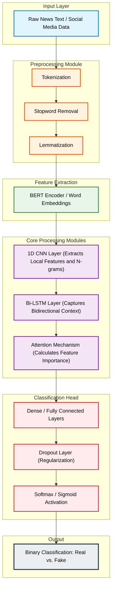

# Model Architecture Graph

```mermaid
graph TD
    subgraph InputLayer [Input Layer]
        raw["Raw News Text / Social Media Data"]
    end

    subgraph PreprocessingModule [Preprocessing Module]
        direction TD
        tok["Tokenization"]
        stop["Stopword Removal"]
        lem["Lemmatization"]
    end

    subgraph FeatureExtraction [Feature Extraction]
        bert["BERT Encoder / Word Embeddings"]
    end

    subgraph CoreProcessing [Core Processing Modules]
        direction TD
        cnn["1D CNN Layer (Extracts Local Features and N-grams)"]
        bilstm["Bi-LSTM Layer (Captures Bidirectional Context)"]
        attn["Attention Mechanism (Calculates Feature Importance)"]
    end

    subgraph ClassificationHead [Classification Head]
        direction TD
        dense["Dense / Fully Connected Layers"]
        drop["Dropout Layer (Regularization)"]
        softmax["Softmax / Sigmoid Activation"]
    end

    subgraph OutputModule [Output]
        result["Binary Classification: Real vs. Fake"]
    end

    raw --> tok
    tok --> stop
    stop --> lem
    lem --> bert
    
    bert --> cnn
    cnn --> bilstm
    bilstm --> attn
    
    attn --> dense
    dense --> drop
    drop --> softmax
    
    softmax --> result

    classDef inputStyle fill:#e1f5fe,stroke:#0277bd,stroke-width:2px,color:#000;
    classDef preprocStyle fill:#fff3e0,stroke:#e65100,stroke-width:2px,color:#000;
    classDef featureStyle fill:#e8f5e9,stroke:#2e7d32,stroke-width:2px,color:#000;
    classDef coreStyle fill:#f3e5f5,stroke:#7b1fa2,stroke-width:2px,color:#000;
    classDef classStyle fill:#ffebee,stroke:#c62828,stroke-width:2px,color:#000;
    classDef outStyle fill:#eceff1,stroke:#37474f,stroke-width:3px,color:#000;

    class raw inputStyle;
    class tok,stop,lem preprocStyle;
    class bert featureStyle;
    class cnn,bilstm,attn coreStyle;
    class dense,drop,softmax classStyle;
    class result outStyle;
```
